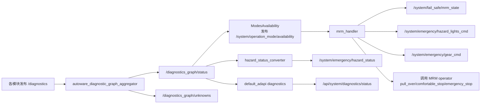
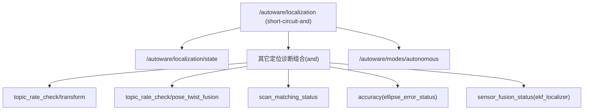

# Autoware 诊断与定位信号链路分析（整理版）

本文整理了本次排查中的全部关键结论，覆盖以下问题：

- `/diagnostics` 出现 `ERROR` 后，系统会触发什么逻辑？
- 谁在接收、谁在处理这些信号？
- localization 初始化状态和 diagnostics 错误的关系是什么？
- 为什么有些 `ERROR` 不会触发 MRM？

---

## 1. 结论先看

1. `/diagnostics` 的 `ERROR` **不会直接触发停车**。  
它先进入 diagnostic graph 聚合，再影响 `/system/operation_mode/availability`，最后由 `mrm_handler` 判定是否进入 MRM（紧急处置）。

2. 只有 **命中 graph 配置** 的诊断项才会影响主链路。  
未命中的项会进入 `/diagnostics_graph/unknowns`，通常只用于观察，不会改变 mode availability。

3. localization 的 ADAPI 初始化状态（`/api/localization/initialization_state`）本身没有 `ERROR` 枚举；  
初始化服务（`/api/localization/initialize`）失败会返回错误码给服务调用方，但这条链路与 `/diagnostics` 链路是两套机制。

---

## 2. 全链路总览（主链路）



---

## 3. 节点职责和触发点

### 3.1 `/diagnostics` 输入与 graph 匹配

- `aggregator` 订阅 `/diagnostics`。
- 每条 `DiagnosticStatus` 按 `status.name` 精确匹配 graph 里的 diag 叶子。
- 匹配成功：更新 graph 节点等级。
- 匹配失败：放入 `unknowns`。

核心代码：

- `sub_input_ = create_subscription<DiagnosticArray>("/diagnostics", ...)`
- `if (!graph_.update(stamp, status)) unknown_diags_[status.name] = status;`

要点：

- 诊断名是关键，不是 topic 名。
- 同样是 `ERROR`，命中与否结果完全不同。

---

### 3.2 graph 如何计算 level

graph 的单位类型：

- `and` / `short-circuit-and`：取子节点中更差的等级（本实现都按 max 级别聚合）。
- `or`：取更好的等级（min 逻辑）。
- `diag`：直接由 `status.level` 驱动，并带超时转 `STALE` 逻辑。

关键实现点：

- `DiagUnit::on_diag()` 直接写入 `status_.level = status.level`
- `DiagUnit::on_time()` 超时后改为 `STALE`
- `MaxUnit`/`ShortCircuitMaxUnit` 聚合子节点级别

---

### 3.3 从 graph 到 operation_mode 可用性

`ModesAvailability` 将 graph 中固定路径（如 `/autoware/modes/autonomous`）转换为 `/system/operation_mode/availability`：

- 某模式对应节点 level 为 `OK` 才可用。
- 只要不是 OK（WARN/ERROR/STALE），该模式可用性就会变 `false`。

这一步是连接“诊断错误”和“车辆控制策略”的关键桥梁。

---

### 3.4 MRM 如何被触发

`mrm_handler` 订阅 `/system/operation_mode/availability`，并以此判定是否 emergency：

- `isEmergency()` 条件之一：`!operation_mode_availability_->autonomous`
- emergency 成立后进入 MRM 状态机，执行：
  - `PULL_OVER`
  - `COMFORTABLE_STOP`
  - `EMERGENCY_STOP`

默认参数下：

- `use_pull_over: false`
- `use_comfortable_stop: false`

所以默认更容易走 `EMERGENCY_STOP` 分支。

---

### 3.5 hazard 与 ADAPI 诊断输出（旁路）

这两条也接收 graph 结果，但通常不是 MRM 的直接输入：

- `hazard_status_converter`  
  `/diagnostics_graph/*` -> `/system/emergency/hazard_status`  
  当 hazard level 为 `SINGLE_POINT_FAULT` 时，`emergency=true`。

- `default_adapi diagnostics`  
  `/diagnostics_graph/*` -> `/api/system/diagnostics/struct|status`  
  主要给 API/UI 使用。

---

## 4. localization 场景下的具体链路

`autoware-main.yaml` 中 `/autoware/modes/autonomous` 依赖 `/autoware/localization`。  
`localization.yaml` 决定了 `/autoware/localization` 由哪些诊断项组成。

### 4.1 localization 结构（逻辑上）



### 4.2 典型命名映射（非常关键）

graph 里每个 `diag` 叶子有 `node` 和 `name`，内部匹配键为：

`"<node>: <name>"`

例如：

- `node: localization`, `name: ekf_localizer`  
  期望诊断名：`localization: ekf_localizer`  
  EKF 实际正是这样发布。

- `node: ndt_scan_matcher`, `name: scan_matching_status`  
  期望诊断名：`ndt_scan_matcher: scan_matching_status`  
  NDT 使用 `DiagnosticsInterface(this, "scan_matching_status")`，节点名是 `ndt_scan_matcher`。

- `node: localization_error_monitor`, `name: ellipse_error_status`  
  期望诊断名：`localization_error_monitor: ellipse_error_status`

- `node: component_state_diagnostics`, `name: localization_state`  
  期望诊断名：`component_state_diagnostics: localization_state`

只要 `status.name` 不一致（哪怕都是 localization 相关），就可能进 unknown 而不影响主链路。

---

## 5. 为什么有的 ERROR 不触发 MRM

常见原因：

1. 诊断名未命中 graph（最常见）。  
现象：在 `/diagnostics_graph/unknowns` 看到该项。

2. 命中的是不影响 autonomous 的分支。  
例如某些路径可能未被 `/autoware/modes/autonomous` 依赖。

3. 你看的不是 `/diagnostics` 主图链路，而是别的状态链路。  
如某些 UI/调试 topic 变化不代表 mode availability 已变化。

4. 运行时 graph 文件不是你以为的那个。  
`system.launch.xml` 中 `diagnostic_graph_aggregator_graph_path` 可被替换。

---

## 6. 与 localization ADAPI 初始化接口的关系

### 6.1 `/api/localization/initialization_state`

该消息只有：

- `UNKNOWN`
- `UNINITIALIZED`
- `INITIALIZING`
- `INITIALIZED`

没有 `ERROR` 枚举。

### 6.2 `/api/localization/initialize` 服务

服务返回 `ResponseStatus`（可失败），并定义了：

- `ERROR_UNSAFE`
- `ERROR_GNSS_SUPPORT`
- `ERROR_GNSS`
- `ERROR_ESTIMATION`

这是“初始化调用结果”错误，不等同于 `/diagnostics` 错误链路。

### 6.3 `autoware_state` 的行为

`autoware_state` 会订阅 `/api/localization/initialization_state`。  
若 localization 未 `INITIALIZED`，系统状态会保持 `INITIALIZING`。

这不是 MRM 触发链，而是系统状态机展示逻辑。

---

## 7. 另一条常被混淆的链：component_state_monitor

`component_state_monitor` 也订阅 `/diagnostics`，但它只关注：

- `hardware_id == "topic_state_monitor"`

用途：

- 发布 `/system/component_state_monitor/component/launch/*`
- 供 `autoware_state` 判断 launch 阶段是否完成

所以它与 diagnostic graph -> availability -> MRM 是不同通道。

---

## 8. 时序与默认参数（影响“多久触发”）

- diagnostic graph 聚合器默认发布频率：`10 Hz`
- mrm_handler 更新频率：`10 Hz`
- mrm_handler 对 availability 超时判定：`0.5 s`

因此从某条关键诊断变为 ERROR 到 availability/MRM 反应，通常是“百毫秒级到亚秒级”，具体取决于上游发布周期和通信延迟。

---

## 9. 排查实操清单

### 9.1 先确认是否命中 graph

1. 看原始诊断：

```bash
ros2 topic echo /diagnostics
```

2. 看是否进 unknown：

```bash
ros2 topic echo /diagnostics_graph/unknowns
```

3. 看 graph 总状态：

```bash
ros2 topic echo /diagnostics_graph/status
```

### 9.2 再看是否影响 mode availability

```bash
ros2 topic echo /system/operation_mode/availability
```

### 9.3 最后看 MRM 是否进入

```bash
ros2 topic echo /system/fail_safe/mrm_state
```

---

## 10. 关键代码与配置索引

### 10.1 主链路

- `system/autoware_diagnostic_graph_aggregator/src/node/aggregator.cpp`
- `system/autoware_diagnostic_graph_aggregator/src/node/availability.cpp`
- `system/autoware_mrm_handler/src/mrm_handler/mrm_handler_core.cpp`
- `system/autoware_hazard_status_converter/src/converter.cpp`
- `system/autoware_default_adapi/src/diagnostics.cpp`

### 10.2 graph 配置

- `system/autoware_system_diagnostic_monitor/config/autoware-main.yaml`
- `system/autoware_system_diagnostic_monitor/config/localization.yaml`

### 10.3 localization 相关发布方

- `localization/autoware_ekf_localizer/src/ekf_localizer.cpp`
- `localization/autoware_ndt_scan_matcher/src/ndt_scan_matcher_core.cpp`
- `localization/autoware_localization_error_monitor/src/localization_error_monitor.cpp`
- `localization/autoware_pose_instability_detector/src/pose_instability_detector.cpp`
- `system/autoware_system_diagnostic_monitor/script/component_state_diagnostics.py`

### 10.4 ADAPI localization/state

- `common/autoware_adapi_specs/include/autoware/adapi_specs/localization.hpp`
- `system/autoware_default_adapi/src/localization.cpp`
- `system/autoware_default_adapi/src/compatibility/autoware_state.cpp`
- `core/autoware_adapi_msgs/autoware_adapi_v1_msgs/localization/msg/LocalizationInitializationState.msg`
- `core/autoware_adapi_msgs/autoware_adapi_v1_msgs/localization/srv/InitializeLocalization.srv`

---

## 11. 最终总结

- 你问的“`/diagnostics` 给了 `ERROR` 会怎样”：  
  不是直接触发停车，而是先过 diagnostic graph；只有命中配置并影响 `/autoware/modes/autonomous`，才会通过 availability 驱动 `mrm_handler` 进入 emergency/MRM。

- 你问的“谁接收处理”：  
  主处理链是 `aggregator -> availability -> mrm_handler`；  
  同时有 `hazard_status_converter` 和 `default_adapi diagnostics` 做状态输出；  
  另有 `component_state_monitor` 走独立的 launch/autoware_state 辅助链路。

